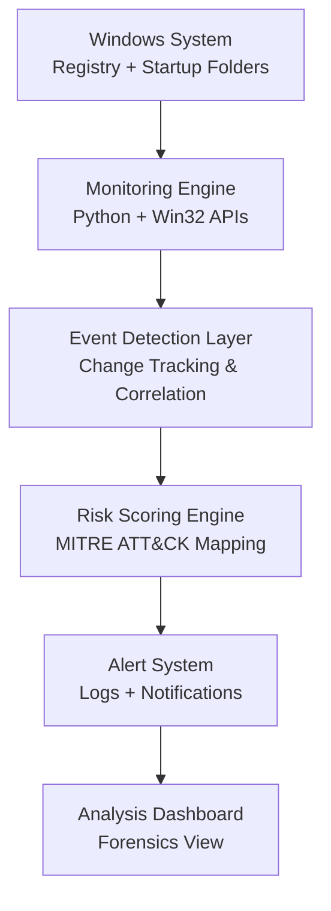

<!-- README.md for Hive Guard – Registry Persistence Monitor -->

  
  
  
  

<h1 align="center">🛡️ Hive Guard</h1>
<h3 align="center">Registry Persistence Monitor for Windows</h3>

  <strong>Real-time registry monitoring · Persistence detection · Forensic analysis</strong> 
  <em>Defensive monitoring system for Windows security research</em>

  <a href="#-overview">Overview</a> •
  <a href="#-key-features">Features</a> •
  <a href="#-architecture">Architecture</a> •
  <a href="#-tech-stack">Tech Stack</a> •
  <a href="#-how-it-works">How It Works</a> •
  <a href="#-screenshots">Screenshots</a>

---

## 📌 Overview

**Hive Guard** is a Windows-based security monitoring tool designed to detect and analyze persistence mechanisms used by malware and advanced persistent threats (APTs).

It continuously monitors critical Windows registry hives and startup locations to detect unauthorized modifications in real time.

---

## 🎯 Key Features

| Feature | Description |
|---------|-------------|
| 🔍 **Registry Monitoring** | Real-time monitoring of critical Windows registry hives |
| 🧠 **Persistence Detection** | Detects malware persistence techniques |
| 📂 **Startup Tracking** | Monitors startup folder modifications |
| 📊 **Risk Scoring** | Behavior-based risk evaluation system |
| 📝 **Structured Logging** | Forensic-ready logs for investigation |
| 🔔 **Alert System** | Real-time notifications for suspicious changes |
| ⚡ **Lightweight Service** | Runs in background with minimal overhead |

---

## 🏗️ Architecture

## 📸 Screenshots

